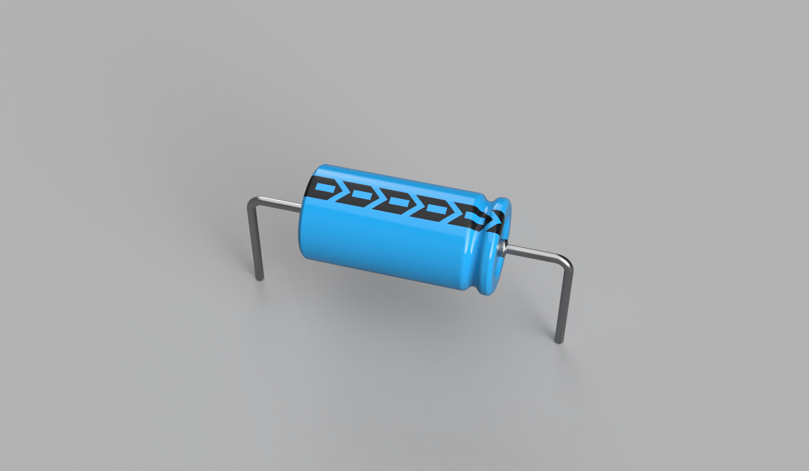
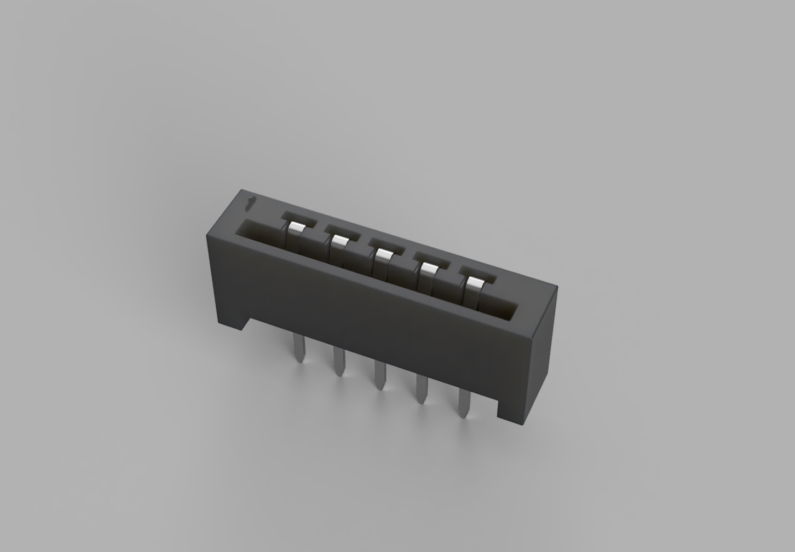
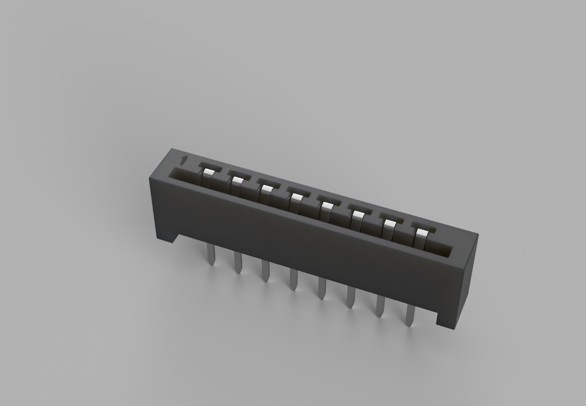
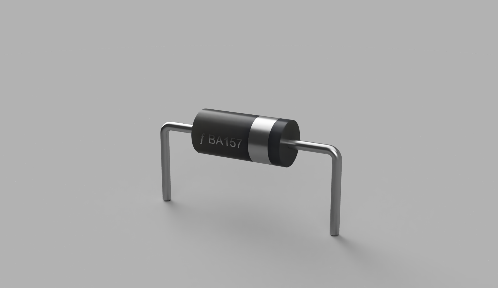
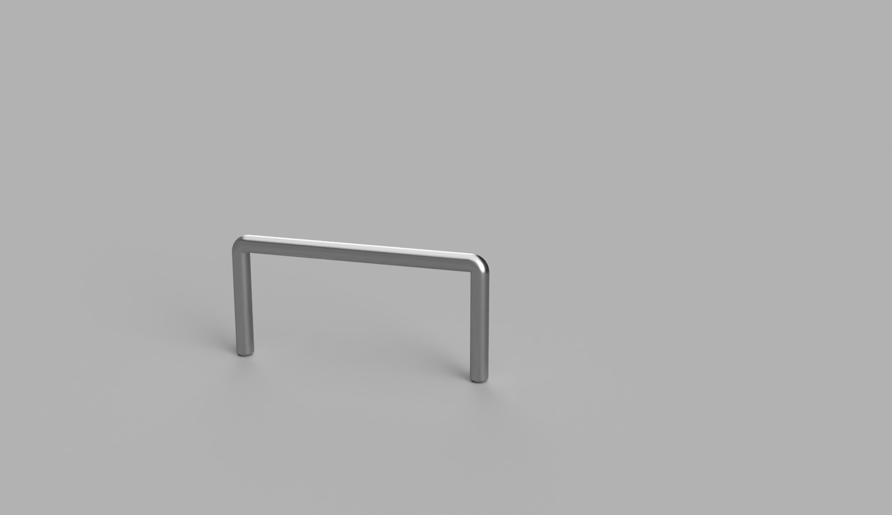
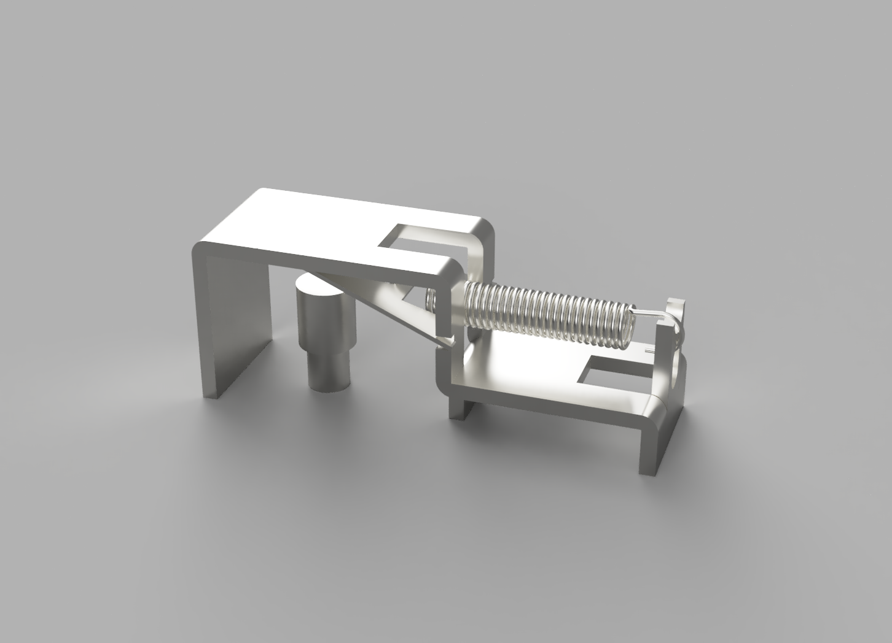

  

# PCB Component & 3D Design Library

A collection of recreated and custom **PCB components, footprints and 3D models** intended for electronics design, restoration, documentation, prototyping and retro hardware projects.

The repository contains general-purpose components that may be reused across multiple PCB designs and hardware platforms.

System-specific components and complete restoration projects are maintained in their respective repositories.

## File formats

Each component folder contains the available model files and, where available, a rendered preview.

- **OBJ + MTL** — provided together for **EasyEDA** use.
  - The OBJ contains the geometry.
  - The MTL contains the material / colour information.
  - Keep the OBJ and MTL together when importing.
- **STEP** — generic CAD format.
  - Suitable for **KiCad** 3D PCB views.
  - Can also be used in Fusion, FreeCAD and other STEP-compatible CAD/EDA software.

## Footprints

If footprints are available, they are located in the respective component subfolder.

The component may contain an additional `footprint` directory containing a JSON file exported directly from **EasyEDA**.

Each footprint may include:

- PCB layers
- Silkscreen
- Component outline / shape
- Pad and pin shapes
- Pin numbering
- Additional component-specific information where required

## Current designs

### [AUDIO_JACK_3PIN](./AUDIO_JACK_3PIN/)

3-pin through-hole audio connector recreation.

---

### [CAP-TH_BD6.3-L12.0-P20.32-D0.6](./CAP-TH_BD6.3-L12.0-P20.32-D0.6/)

Axial through-hole capacitor model with Ø6.3 mm body, 12.0 mm body length and 20.32 mm PCB pitch.

---

### [COIL_L1](./COIL_L1/)

Through-hole coil / transformer recreation.

---

### [CONN-TH_5P-P2.54_520315-5](./CONN_TH_5P_P2.54_520315-5/)

TE Connectivity / AMP 520315-5 style 5-pin through-hole connector.

---

### [CONN-TH_8P-P2.54_520315-8](./CONN_TH_8P_P2.54_520315-8/)

TE Connectivity / AMP 520315-8 style 8-pin through-hole connector.

---

### [DO-35_P12.70_BA157](./DO-35_P12.70_BA157/)

DO-35 axial diode model with 12.70 mm PCB pitch.

---

### [Jumper](./JUMPER-TH_P7.80-D0.53/)

Through-hole PCB jumper / wire-link model.

---

### [MICROSWITCH_OPEN_FRAME_SPRING_LEVER](./MICROSWITCH_OPEN_FRAME_SPRING_LEVER/)

Open-frame spring-lever microswitch recreation for retro hardware and joystick designs.

## System-specific projects

### ZX Spectrum 48K

ZX Spectrum-specific components and recreations are maintained separately:

**[ZX Spectrum 48K PCB / component designs](https://github.com/bljakk-alt/ZX-Spectrum-48k)**

This includes period-correct and machine-specific components such as the ULA, ROM, Z80, RF modulator, heatsink assemblies and speakers.

## Usage

For **EasyEDA**, use the **OBJ + MTL** files together. If they are distributed as a ZIP archive, keep both files together so the material reference remains available.

For **KiCad**, the **STEP** file is generally the most convenient choice and can be assigned directly as the footprint's 3D model.

The STEP files are not tied to a specific EDA package and may also be used in Fusion, FreeCAD and other CAD or PCB tools that support STEP.

## License

These models are licensed under the **Creative Commons Attribution-NonCommercial 4.0 International License (CC BY-NC 4.0)**.

They are free to use, share and modify for **non-commercial purposes**, with attribution. **Commercial use requires separate written permission.**

See the full repository license: **[LICENSE.md](./LICENSE.md)**.

## Notes

These are independently recreated component models intended for electronics design, preservation, repair, documentation and hobbyist PCB work.

Product names and trademarks belong to their respective owners.

More components will be added as the library grows.